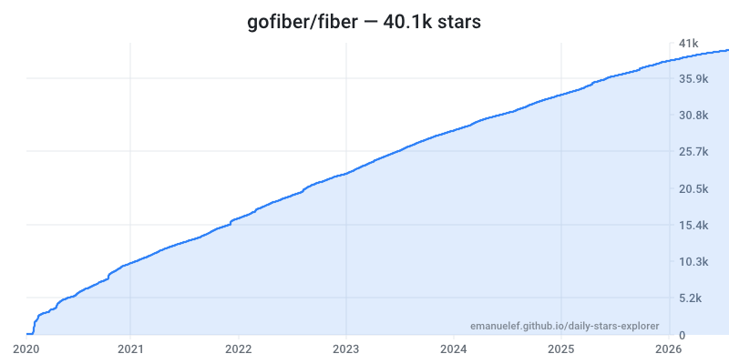
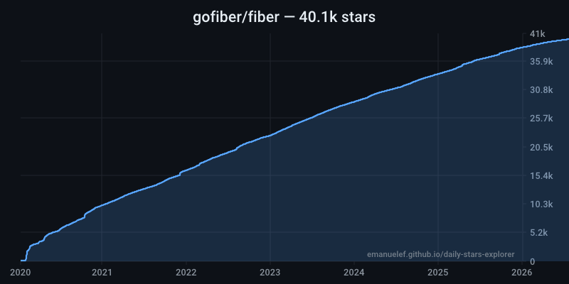
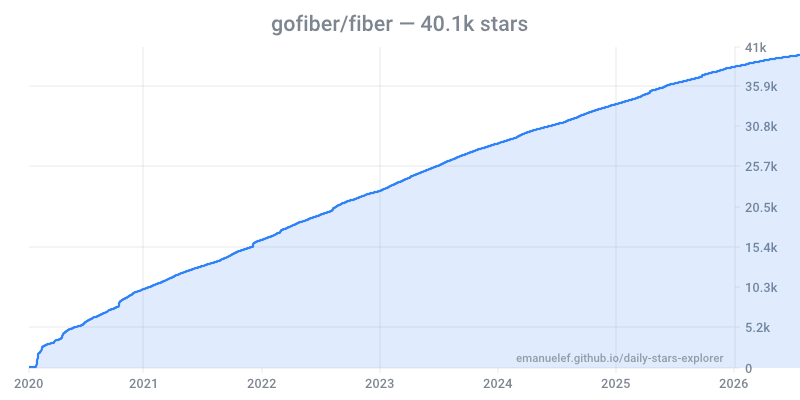
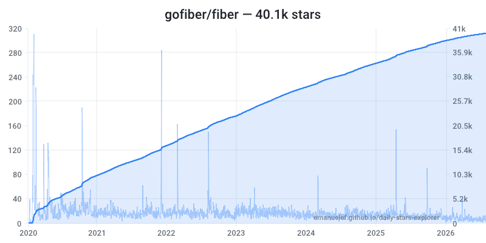
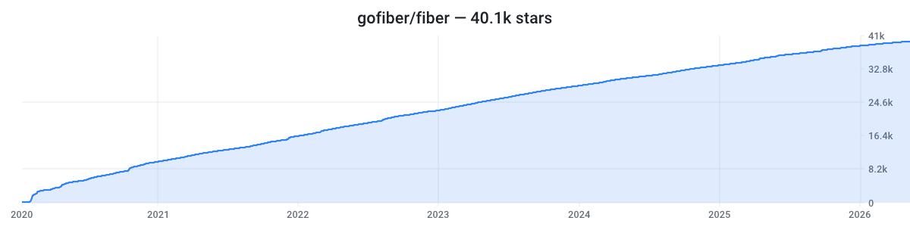
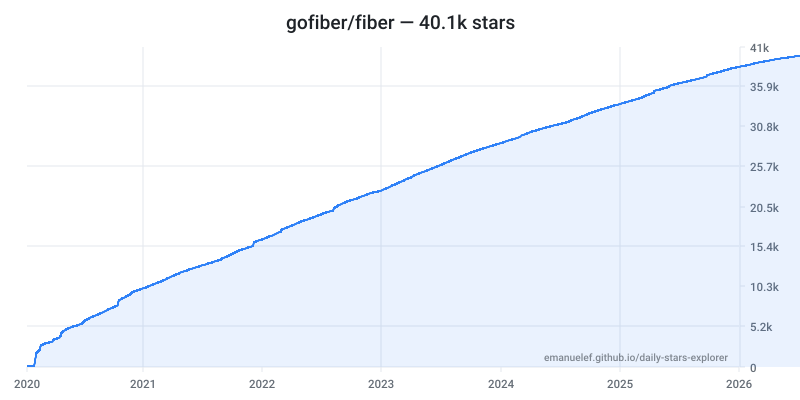
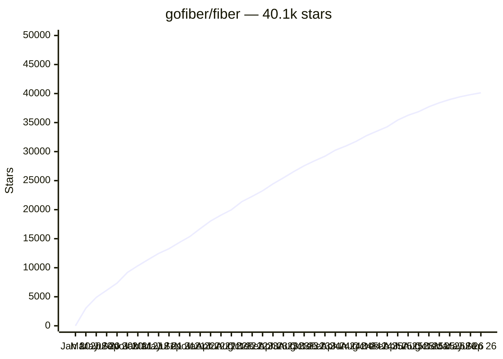

# Star chart gallery — `gofiber/fiber`

Every output the [`starchart`](../../cmd/starchart) tool can produce, so you can
pick one for your own README. Regenerate with:

```bash
./scripts/gen-gallery.sh gofiber/fiber
```

Generated 2026-09-06 19:17 UTC.

## PNG — `-theme light` (default)

```markdown

```


## PNG — `-theme dark`



## PNG — `-theme transparent`

Draws no background, so it sits on whichever GitHub theme the reader uses. This
is the one to pick if you only want to ship a single image.



## Light and dark in one image

GitHub picks per reader theme with a `<picture>` element:

```html
<picture>
  <source media="(prefers-color-scheme: dark)" srcset="./gofiber-fiber-dark.png">
  
</picture>
```

<picture>
  <source media="(prefers-color-scheme: dark)" srcset="./gofiber-fiber-dark.png">
  
</picture>

## PNG — `-daily`

Overlays per-day counts on a second axis, so spikes are visible instead of
being flattened into the cumulative curve.



## PNG — `-width 1200 -height 300`

A banner shape, for the top of a README.



## SVG

Same renderer, vector output. Stays sharp when the reader zooms the page, and
is usually a smaller file.

```markdown

```


## Mermaid — the only zoomable option

Not an image: GitHub renders this natively, so it follows the reader's theme
and gets GitHub's built-in pan and zoom controls. The trade-off is that it is
downsampled to 40 points and is much less precise than the images above.



## Clickable chart

Wrap any image in a link to the live explorer, so a click goes from a static
picture to the full interactive chart:

```markdown
[](https://emanuelef.github.io/daily-stars-explorer/#/gofiber/fiber)
```

[](https://emanuelef.github.io/daily-stars-explorer/#/gofiber/fiber)
